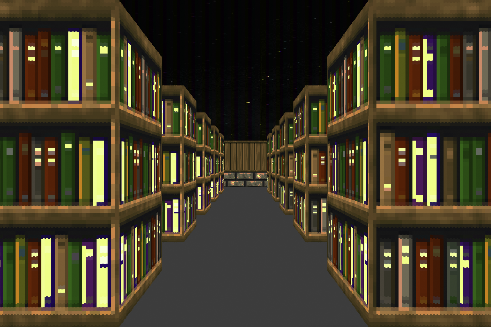

# Wolf3d

## Description

Ce projet est inspiré du célèbre jeu Wolfenstein 3D, l'un des premiers FPS.



## Installation

``` bash
$> git clone https://github.com/bmoiroud/wolf3d.git && cd wolf3d && make
```

## Utilisation

``` bash
$> ./wolf3d <map>
```

| Touche  | Action             |
|:-------:|:-------------------|
| W       | avancer            |
| S       | reculer            |
| A       | tourner à gauche   |
| D       | tourner à droite   |
| esc     | quitter            |
