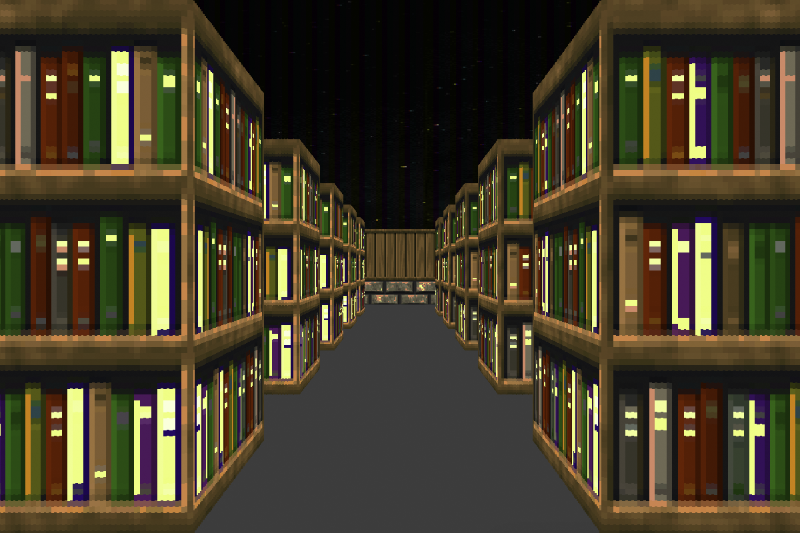

# wolf3d

## Project Overview

This project is inspired by the famous game Wolfenstein 3d, which was one of the first FPS.



## Installation

``` bash
$> git clone https://github.com/bmoiroud/wolf3d.git && cd wolf3d && make
```

## Usage

``` bash
$> ./wolf3d <map>
```

| Key     | Action             |
|:-------:|:-------------------|
| W       | move forward       |
| S       | move backward      |
| A       | turn left          |
| D       | turn right         |
| esc     | quit               |
